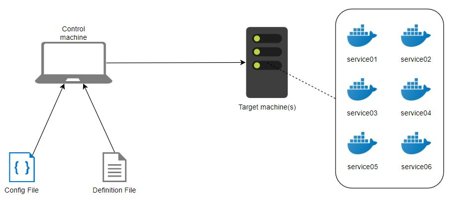

# MSAC
#### Project 1: Chiminigagua
This is the simplest project: from a control machine, we will deploy to a server 

## Architecture

So in general terms, you will have to edit the config file, which will have specific information about our setup. And then you will edit the definitio file, usually to enable or disable sections to pick the services you will use as running containers.

## Usage

## Example

